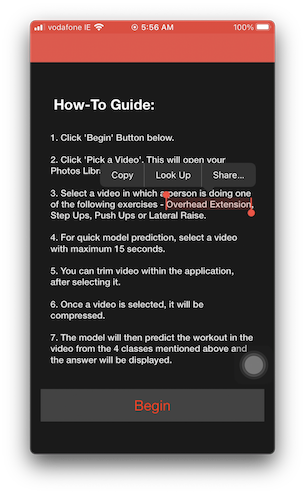
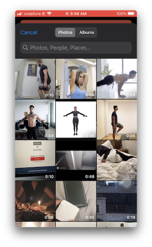
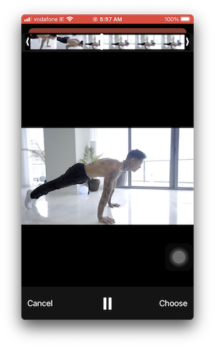

# Work It Application

This application was created as part of Final Year Project in College.\
It implements an Image Classifier Machine Learning Model created in Apple's Framework, called CreateML. This model was trained on images for 4 Gym Exercises - Step Ups, Push Ups, Lateral Raise and Overhead Extension. These images were manually collected from internet.
#### Training - 97%
#### Validation - 97% 
#### Testing - 59%

## Here are the screen shots

### To test the app

1. Clone the repo.
2. Connect a physical iPhone with the Mac.
3. Check if the iOS and Xcode versions are compatible.
4. Sign in to Xcode and trust the developer setting on phone.
5. Run the app.
